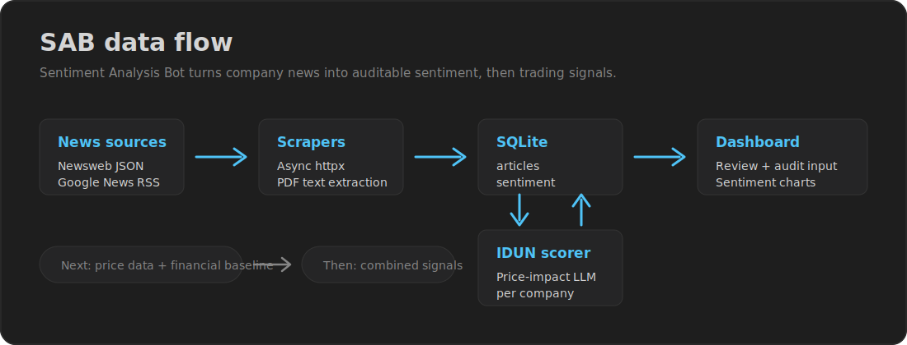
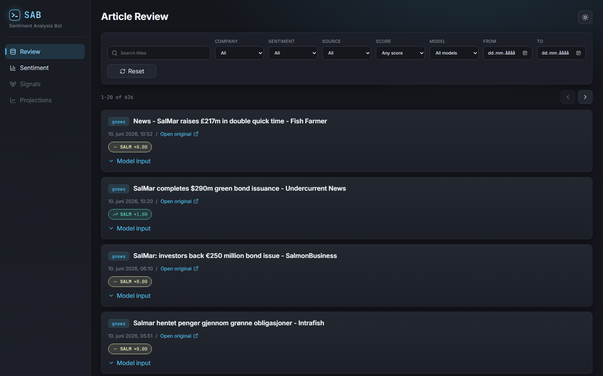
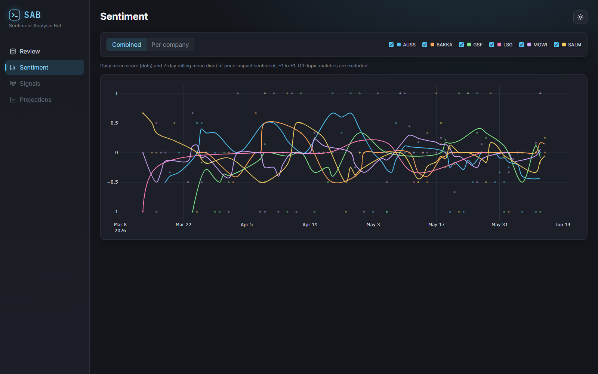

<p align="center">
  
</p>

# SAB

[](https://github.com/NicolaiBaklund/SAB/actions/workflows/pytest.yml)


SAB is a **Sentiment Analysis Bot** for Norwegian stock research. It collects
company news, stores article text in SQLite, exposes a review dashboard, and is
being built toward company-level sentiment scoring, financial analysis, and signal
generation.



## Current Stage

SAB currently has the data foundation, the sentiment scoring stack, and two
dashboard views in place.

- **Company registry:** `companies.json` defines the active companies, keywords,
  and Newsweb issuer ids. The system reads this dynamically; companies are not
  hardcoded in the dashboard, scorer, or charts.
- **News ingestion:** `src/data/newsweb.py` fetches Oslo Bors Newsweb
  announcements, including PDF attachment text via `markitdown`.
- **RSS ingestion:** `src/data/rss.py` fetches Google News RSS results per active
  company and stores one article row per matched company.
- **Database:** SQLAlchemy async models store `articles` and `sentiment` rows in
  SQLite, managed by Alembic migrations.
- **Sentiment scoring:** `src/nlp/` scores each active-company article's price
  impact per ticker via IDUN (model chosen by bake-off); off-topic keyword
  matches are flagged and excluded from analytics (see `docs/sentiment.md`).
- **Review dashboard:** FastAPI serves read-only review data to a React/Vite
  frontend. The review page groups article rows by URL, shows source, company
  bubbles, sentiment or explicit unscored state, filters, pagination, and the
  reconstructed model input from stored title/body.
- **Sentiment page:** Plotly time-series of predicted sentiment per active
  company — daily mean (dots) plus a 7-day rolling mean (line), as a combined
  chart with company filtering or per-company panels.





*Screenshots use sample scores for preview; real scores come from the IDUN
scoring run.*

## What Works Today

| Area | Status |
| --- | --- |
| Company config | Done |
| SQLite schema and migrations | Done |
| Newsweb scraper | Done |
| Google News RSS scraper | Done |
| Incremental fetch workflow | Done |
| Read-only article review dashboard | Done |
| Sentiment-over-time dashboard (Plotly) | Done |
| IDUN sentiment scoring | Built (`src/nlp/`, active companies only); bake-off chose Mistral-Large-3-675B; first full run pending — see `docs/sentiment.md` |
| Financial analysis baseline | Planned |
| Price data and sentiment correlation | Planned |
| Trading signal generation | Planned |

## Quick Start

Requirements:

- Python 3.10+
- Node.js 20+

Install Python dependencies:

```bash
pip install -r requirements.txt
```

Install frontend dependencies:

```bash
cd frontend
npm install
```

Create `.env.local` in the repository root:

```bash
IDUN_KEY=sk-...
DATABASE_URL=sqlite+aiosqlite:///./data/sab.db
```

Create or migrate the database:

```bash
alembic upgrade head
```

Fetch data:

```bash
python -m src.data.newsweb --backfill
python -m src.data.rss --backfill
```

Run the API:

```bash
uvicorn src.api.main:app --reload
```

Run the dashboard in another terminal:

```bash
cd frontend
npm run dev
```

Open:

```text
http://localhost:5173/review     — article review
http://localhost:5173/sentiment  — sentiment over time
```

## Development Checks

Backend:

```bash
pytest
```

Frontend:

```bash
cd frontend
npm run test
npm run typecheck
npm run build
```

## Project Plan

1. **Finish review and data quality workflows**
   - Keep the article review page read-only.
   - Use it to inspect source coverage, duplicate stories, false-positive ticker
     matches, and stored model input.
   - Tighten company keywords in `companies.json` as data quality issues appear.

2. **Add sentiment scoring** — built (`src/nlp/`); first full scoring run pending
   - Scores stored `title` and `body` only, per company/ticker (active companies
     only), and writes `score`, `label`, `relevance`, `model`, and `scored_at`
     to the `sentiment` table.

3. **Add financial analysis as the signal baseline**
   - Add company-level financial metrics such as price history, returns,
     volatility, volume, valuation multiples, earnings dates, and sector-specific
     indicators where available.
   - Keep this layer useful without sentiment, so sentiment can be evaluated as
     an incremental signal rather than the whole strategy.
   - Build reusable data models and API shapes for time series, fundamentals, and
     derived indicators.

4. **Add sentiment aggregation and market context**
   - Aggregate sentiment per ticker over a rolling window.
   - Add price data from Yahoo Finance or Euronext.
   - Compare sentiment moves with price moves, financial baselines, and lag
     windows.

5. **Generate signals and expand dashboard views**
   - ~~Add sentiment-over-time charts.~~ Done — see the Sentiment page.
   - Add price overlays.
   - Add financial-analysis, signal, and projection views beside the review page.

## Repository Map

```text
SAB/
  companies.json          company registry
  src/
    api/                  FastAPI read-only dashboard API
    data/                 DB models, async DB helpers, scrapers
    config.py             company config validation
    settings.py           environment and settings loader
  frontend/               React/Vite dashboard
  alembic/                database migrations
  tests/                  pytest suite
  docs/                   setup, architecture, data-source notes
```

## Notes

- `frontend/dist/`, `frontend/node_modules/`, and `data/*.db` are generated or
  local artifacts and are intentionally ignored by Git.
- Google News RSS is unofficial and returns redirect URLs, so canonical article
  URLs may require a later source upgrade.
- The same event can appear through Newsweb and RSS; cross-source deduplication
  is deferred until scoring/aggregation can compare title, ticker, and publish
  time.
